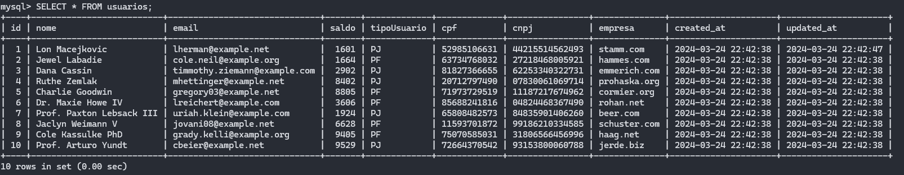
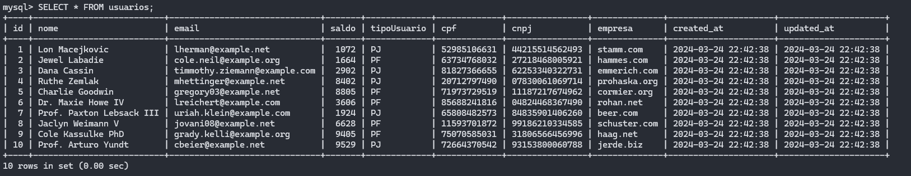
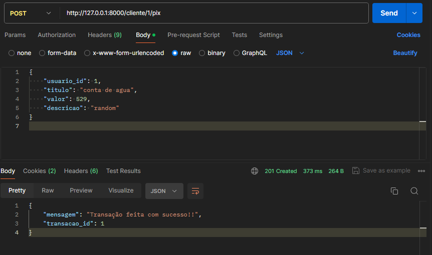

# PAYLOAD PHP

Projeto baseado no desafio "Rinha de backend" feito inteiramente com PHP/Laravel e MySQL para persistencia de dados.

## Tecnologias
- Backend -> PHP/LARAVEL
- Database -> MySQL(FakerPHP/Faker)

## Esquema Mysql

# Antes de rodar o comando de transação:

# Depois de rodar o comando de transação: 

# EndPoint

## Social
- Github: https://github.com/Klleriston
- Linkedin: https://www.linkedin.com/in/klleriston-andrade-860a22228/
- X: https://twitter.com/devkekz

